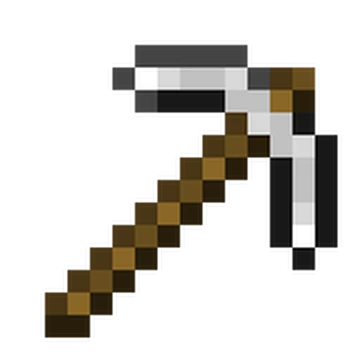
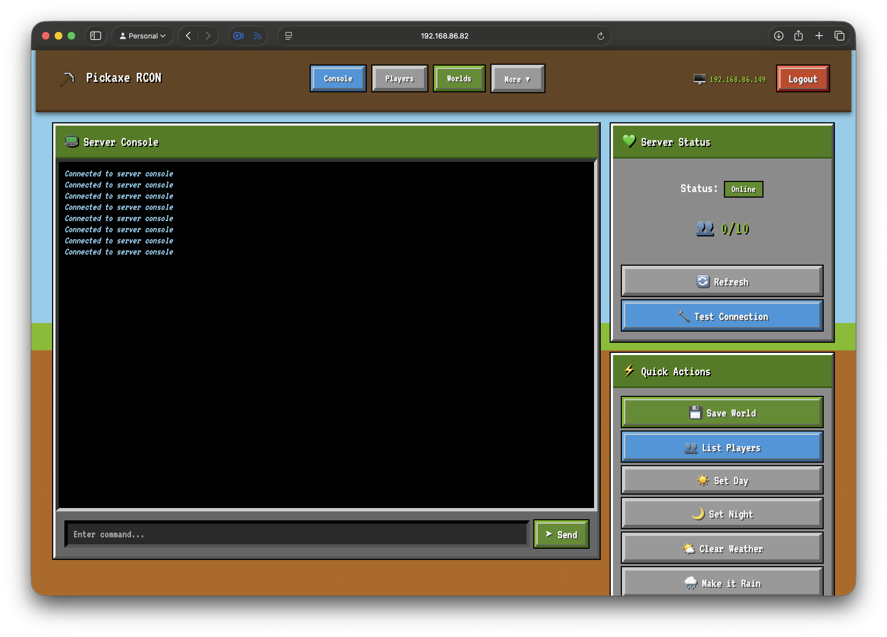

#  Pickaxe RCON

> Mine deep into your Minecraft Bedrock server management - A powerful, user-friendly web-based admin panel

[](https://hub.docker.com/r/xtamtamx/pickaxe-rcon)
[](https://github.com/xtamtamx/pickaxe-rcon/stargazers)
[](LICENSE)



## ✨ Features

- 🎮 **Real-time Console** - Execute commands with live WebSocket output
- 👥 **Player Management** - View, kick, OP, teleport, give items, and more
- ⚙️ **Server Configuration** - Edit server.properties and gamerules in the UI
- 💾 **World Management** - Backup, restore, and create new worlds with custom seeds
- 📋 **Whitelist & Operators** - Full CRUD operations for access control
- 📊 **Performance Monitoring** - Real-time server metrics and resource usage
- 📜 **Log Viewer** - Searchable, filterable logs with auto-refresh
- ⏰ **Task Scheduler** - Automate commands with intervals or cron schedules
- 🗺️ **Map Integration** - Optional integration with uNmINeD and other map tools
- 🔒 **Secure** - Login system, session management, and security best practices
- 🚀 **Easy Setup** - First-run wizard, Docker support, works locally or remotely

## 🚀 Quick Start

### Option 1: Local Server (Same Machine)

For Minecraft servers running on the same machine as the panel:

```bash
docker run -d \
  --name pickaxe-rcon \
  -p 5000:5000 \
  -v pickaxe-data:/app/data \
  -v /var/run/docker.sock:/var/run/docker.sock:ro \
  xtamtamx/pickaxe-rcon:latest
```

### Option 2: Remote Server (NAS/VPS via SSH)

For Minecraft servers on a remote machine (QNAP, Synology, VPS):

```bash
docker run -d \
  --name pickaxe-rcon \
  -p 5000:5000 \
  -v pickaxe-data:/app/data \
  -v ~/.ssh/id_rsa:/root/.ssh/minecraft_panel_rsa:ro \
  xtamtamx/pickaxe-rcon:latest
```

> **Note:** Mount your SSH private key that has access to the remote server.

### First Run

1. Open `http://localhost:5000`
2. Complete the **Setup Wizard**:
   - Enter your Minecraft server's SSH/connection details
   - Set admin username and password
3. Start managing your server!

**Security features enabled automatically:**
- Passwords hashed with bcrypt
- Secure session key auto-generated
- Rate limiting on login (5 attempts/min)

### Using Docker Compose

```yaml
version: '3.8'
services:
  pickaxe-rcon:
    image: xtamtamx/pickaxe-rcon:latest
    container_name: pickaxe-rcon
    restart: unless-stopped
    ports:
      - "5000:5000"
    volumes:
      - ./data:/app/data
      - ~/.ssh/id_rsa:/root/.ssh/minecraft_panel_rsa:ro  # For remote servers
      # - /var/run/docker.sock:/var/run/docker.sock:ro  # For local servers
```

```bash
docker-compose up -d
```

📖 **[Full Quick Start Guide](QUICK_START.md)**

## 📸 Screenshots

<details>
<summary>Click to expand</summary>

### Live Console


### Player Management


### Server Settings


### World Backups


</details>

## 🎯 Use Cases

### Home Server
Perfect for managing your home Minecraft server from a web interface

### QNAP/Synology NAS
Remotely manage Minecraft servers running on NAS devices via SSH

### Multiple Servers
Manage several Minecraft instances from one central panel

### Shared Hosting
Give server admins a friendly UI without SSH access

## 📋 Requirements

- Docker (for running the panel)
- Minecraft Bedrock Server in a Docker container
- SSH access (for remote servers)
- Modern web browser

## 🔧 Configuration

The panel supports two connection modes:

### Local Mode
For Minecraft servers on the same machine as the admin panel. Requires Docker socket access.

### SSH Mode
For Minecraft servers on remote machines (QNAP, Synology, dedicated servers). Requires SSH key authentication.

All configuration is done through the web UI - no manual file editing required!

## 📚 Documentation

- **[Quick Start Guide](QUICK_START.md)** - Get running in 5 minutes
- **[Full Documentation](README_DISTRIBUTION.md)** - Complete setup and configuration
- **[Security Guide](SECURITY.md)** - Best practices and security checklist

## 🛠️ Development

### Run from Source

```bash
git clone https://github.com/xtamtamx/pickaxe-rcon.git
cd pickaxe-rcon

cp .env.example .env
# Edit .env with your settings

pip install -r requirements.txt
python app.py
```

### Build Docker Image

```bash
docker build -t pickaxe-rcon:latest .
```

## 🤝 Contributing

Contributions are welcome! Please feel free to submit a Pull Request.

1. Fork the repository
2. Create your feature branch (`git checkout -b feature/AmazingFeature`)
3. Commit your changes (`git commit -m 'Add some AmazingFeature'`)
4. Push to the branch (`git push origin feature/AmazingFeature`)
5. Open a Pull Request

## 🐛 Issues & Support

- **[Report a Bug](https://github.com/xtamtamx/pickaxe-rcon/issues/new?template=bug_report.md)**
- **[Request a Feature](https://github.com/xtamtamx/pickaxe-rcon/issues/new?template=feature_request.md)**
- **[Ask a Question](https://github.com/xtamtamx/pickaxe-rcon/discussions)**

## 🔒 Security

Pickaxe RCON includes several security features out of the box:

| Feature | Description |
|---------|-------------|
| **bcrypt Password Hashing** | Admin passwords are securely hashed, never stored in plaintext |
| **Auto-generated Secret Key** | Cryptographically secure session key created on first run |
| **Rate Limiting** | Login attempts limited to 5 per minute to prevent brute force |
| **Timing Attack Prevention** | Constant-time password comparison with delay on failures |
| **Input Validation** | All user inputs validated and sanitized |
| **Command Injection Prevention** | Shell characters blocked in scheduled commands |

### Security Checklist for Production

- [ ] Use HTTPS (reverse proxy with nginx/Caddy recommended)
- [ ] Set `CORS_ORIGINS` environment variable to your domain
- [ ] Use a strong admin password (min 6 characters required)
- [ ] Keep SSH keys secure with proper permissions (600)
- [ ] Regularly update to latest version

Please review our **[Security Policy](SECURITY.md)** before deploying to production.

To report a security vulnerability, please email security@example.com instead of opening a public issue.

## 📜 License

This project is licensed under the MIT License - see the [LICENSE](LICENSE) file for details.

## ⭐ Star History

If you find this project useful, please consider giving it a star! It helps others discover the project.

[](https://star-history.com/#xtamtamx/pickaxe-rcon&Date)

## 🙏 Acknowledgments

- Built with [Flask](https://flask.palletsprojects.com/)
- WebSocket support via [Flask-SocketIO](https://flask-socketio.readthedocs.io/)
- Authentication via [Flask-Login](https://flask-login.readthedocs.io/)
- Inspired by the Minecraft community

## 📞 Connect

- **GitHub:** [@xtamtamx](https://github.com/xtamtamx)
- **Discord:** [Join our community](#) (optional)
- **Twitter:** [@yourhandle](https://twitter.com/yourhandle) (optional)

---

Made with ❤️ for the Minecraft Bedrock community
